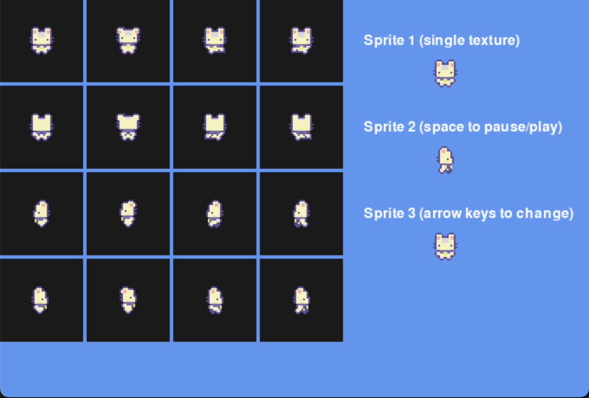

# PygamePal
A library of classes and functions to support game development in Pygame.
- [Add suggestions and bugs here](https://github.com/rik-cross/pygamepal/issues)!

### Usage
- `pip install pygamepal` or `pip install pygamepal --upgrade`

- [Full example](examples/fullExample.py), using lots of pygamepal functionality

### Contents

- [Game](#game)
- [Input](#input)
- [SpriteImage](#spriteImage)
- [Camera](#camera)
- [Particles](#particles)
- [Transitions](#transitions)
- [Utility Functions](#functions)

<a name="game"></a>Game (create a game with minimal setup) -- [Template](templates/gameTemplate.py) // [Example](examples/gameExample.py)

``` 
self.size = (x, y)
self.caption = 'text'
self.icon = pygame.image.load('imageURL')
self.fps = x
self.screen
self.gameTime

self.init()
self.update(gameTime)
self.draw()
self.quit()
```

<a name="input"></a>Input -- [Key Example](examples/keyInputExample.py) // [Mouse Example](examples/mouseInputExample.py)

```
# create new instance
input = pygamepal.Input(longPressDuration=60, doublePressTimeout=30)

# update() must be called once per frame
input.update(deltaTime=1)
# key press methods
input.isKeyDown(keycode)
input.isKeyPressed(keycode)
input.isKeyDoublePressed(keycode)
input.isKeyReleased(keycode)
input.getKeyDownDuration(keycode)
input.isKeyLongDown(keycode)
input.isKeyLongPressed(keycode)
input.getKeyLongPressPercentage(keycode)
# mouse button methods
input.isMouseButtonDown(mouseButton)
input.isMouseButtonPressed(mouseButton)
input.isMouseButtonDoublePressed(mouseButton)
input.isMouseButtonReleased(mouseButton)
input.getMouseButtonDownDuration(mouseButton)
input.isMouseButtonLongDown(mouseButton)
input.isMouseButtonLongPressed(mouseButton)
input.getMouseButtonLongPressPercentage(mouseButton)
```
<a name="spriteImage"></a>SpriteImage -- [Example](examples/spriteImageExample.py) // [Showcase](examples/spriteImageShowcase.py)



```
# create new instance
spriteImage = pygamepal.spriteImage()

# add one or more sprites, associated with a state
spriteImage.addTextures(firstTexture, *moreTextures, state=None, animationDelay=12, loop=True, hFlip=False, vFlip=False)

# update() must be called once per frame
spriteImage.update()

# draw the current image/animation frame
spriteImage.draw()

# change the current image/animation state
# (does not need to be called for sprite with single state)
spriteImage.setState(state)

# resets the current animation
spriteImage.reset()

spriteImage.pause
```

<a name="camera"></a>Camera -- [Example](examples/cameraExample.py)


```
# creates a new camera instance
camera = pygamepal.Camera(position=(0, 0), size=(640, 480), target=(0, 0), zoom=1, backgroundColour='gray30', borderColour='black', borderThickness=2, clamp=False, clampRect=(0, 0, 1000, 1000), followDelay=0)

# update() must be called once per frame
camera.update(deltaTime=1)

# draws surface to the destinationSurface, using camera attributes
camera.draw(surface, destinationSurface)
```

<a name="particles"></a>Particles -- [Example](examples/particlesExample.py) 


```
# creates a new particle emitter
particles = pygamepal.particles(
    # emitter attributes
    emitterPosition=(0,0), emitterSize=(0,0),
    emitterLifetime=100,
    emitterVelocity=(0,0), emitterAcceleration=(0,0),
    emitterParticleDelay=5,
    # particle attributes
    particleVelocityMin=(-1,-1), particleVelocityMax=(1,1),
    particleAccelerationMin=(0,0), particleAccelerationMax=(0,0),
    particleLifetime=100,
    particleSize=20,
    particleSizeDecay=0.2,
    particleColors=None
)

# update() must be called once per frame
particles.update(deltaTime=1)

# call draw() once per frame to draw all particles
particles.draw(surface)
```

<a name="transitions"></a>Transitions -- [Example](examples/transitionExample.py) // [Showcase](examples/transitionShowcase.py)


Transition types:
- TransitionFade
- TransitionFadeToBlack
- TransitionWipeLeft
- TransitionWipeRight
- TransitionWipeUp
- TransitionWipeDown
- TransitionMoveLeft
- TransitionMoveRight
- TransitionMoveUp
- TransitionMoveDown

Easing functions
- linear
- bounceEaseOut

```
# creates a new transition instance
transition = pygamepal.TransitionFade(fromSurface=None, toSurface=None, duration=100, easingFunction=linear)

# update() and draw() should be called each game loop frame
transition.update(deltaTime=1)
transition.draw(surface)

# transition properties
transition.duration = x # number of frames (default) / game time in ms
transition.easingFunction = pygampal.bounceEaseOut
```

<a name="functions"></a>Utility functions

```
# draws text with minimal required parameters
drawText(screen, text, x, y, font=None, antialias=True, color='white', background=None)
# minimal example:
drawText(screen, 'Hello, world!')

# returns a list of sub-textures from a large spritesheet/texture
# the list has the same dimensions as the original texture, but
# can be flattened using flatten(2dList).
splitTexture(texture, newTextureWidth, newTextureHeight)
# simple example, splitting a single 96x32 spritesheet into 4 separate textures:
textureList = splitTexture(texture, 32, 32)
firstTexture = textureList[0][0] # or firstTexture = flatten(textureList)[0]

# flattens a 2d list into a single list
newList = flatten(2dList)
# see above for example
```
